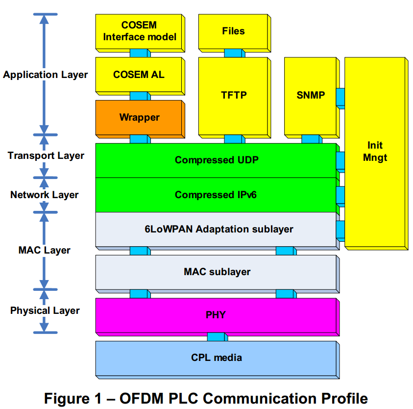
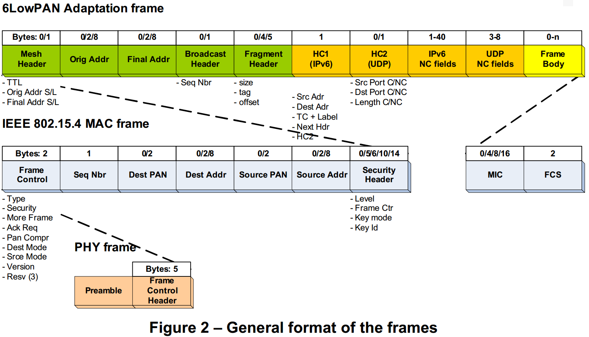

# 4 GENERAL PRESENTATION OF THE OFDM PLC COMMUNICATION PROFILE OFDM PLC通信配置文件的一般介绍

　　The OFDM PLC (Orthogonal Frequency Division Multiplexing - Power Line Carrier) specifications are developed to meet the following aims:  
　　OFDM PLC(正交频分复用-电力载波)规范的开发是为了达到以下的一些目标：
 * Robustness: the communication profile must be suited to severe environments  
 鲁棒性：通信配置文件必须适合恶劣环境
 * Performance: it must take full advantage of the CENELEC A band  
 性能：它必须充分利用CENELEC A频带
 * Simplicity: it must be simple to implement, install (Plug and Play), operate and maintain  
 简单：它必须易于实现，安装（即插即用），操作和维护
 * Flexibility: it must be compatible with diverse applications and network topologies.  
 灵活性：它必须与各种应用和网络拓扑兼容。
 * Security: it must offer a safe environment for the promotion of Value Added services  
 安全：它必须为促进增值服务提供一个安全的环境
 * Openness: it must be based on open standards in order to support multi-supplier solutions.  
 开放性：它必须基于开放标准，以支持多供应商解决方案。
 * Compatibility: it must be able to function in a given network with earlier metering systems and existing Applications  
 兼容性：它必须能够在具有早期计量系统和现有应用程序的给定网络中运行
 * Scalability: it must support all future metering developments.  
可扩展性：它必须支持所有未来的计量开发。

　　To this end, the OFDM PLC protocol stack aggregates several layers and sublayers that form the Transport layer:  
　　为此，OFDM PLC协议栈聚集形成传输层的若干层和子层  
 * A robust high-performance PHY layer, based on OFDM and adapted to the PLC environment(CENELEC band A).  
 坚固的高性能PHY层，基于OFDM并适应PLC环境（CENELEC频段A）。
 * A MAC layer of the IEEE type, well suited to low data rates  
 IEEE类型的MAC层，非常适合低数据速率
 * IPv6, the new generation of IP (Internet Protocol), which widely opens the range of potential applications and services  
 IPv6，新一代IP（互联网协议），其广泛地开放了潜在的应用和服务的范围
 * And to allow good IPv6 and MAC interoperability, an Adaptation sublayer taken from the Internet world and called 6LoWPAN.  
 并且为了允许良好的IPv6和MAC互操作性，适配子层取自互联网世界并称为6LoWPAN。

　　The metering profile proposed herein remains compatible at COSEM application level with the profile adopted for the AMM pilot. Consequently the applications developed in the framework of the AMM pilot, at both meter level and data concentrator, can be reused with this profile.  
　　本文提出的计量分布在COSEM应用级与为AMM导频采用的分布保持兼容。因此，在仪表级和数据集中器处的AMM导频的框架中开发的应用可以与该简档一起重用。

　　Cohabitation between the two profiles is ensured at physical level. The carrier frequencies used by the AMM pilot profile are masked by the OFDM PLC profile, therefore there is no risk of one profile disturbing the other.  
　　在物理层确保两个轮廓之间的共居。由AMM导频简档使用的载波频率被OFDM PLC简档掩蔽，因此不存在一个简档干扰另一个简档的风险。

　　In the case of a random distribution of G1 (S-FSK) and G3 (OFDM) meters over a given low-voltage sub-network, the data concentrator situated at the MV/LV transformer station will have to manage the two profiles simultaneously: that is to say the two modulations (S-FSK and OFDM) as well as the intermediate protocol layers. The application at the concentrator level will be common.  
　　在给定低电压子网上的G1（S-FSK）和G3（OFDM）米的随机分布的情况下，位于MV / LV变压器站的数据集中器将必须同时管理两个分布： 也就是说两个调制（S-FSK和OFDM）以及中间协议层。 集中器级别的应用程序将很常见。

　　The following figure gives an overall view of the OFDM PLC Communication Profile:  
　　下图给出了OFDM PLC通信配置文件的总体视图：

　　The figure below gives the general format of the frames. It shows the headers for all the levels of the Transport layer (PHY, MAC, Adaptation 6LoWPAN, compressed IPv6 and compressed UDP):  
　　下图给出了帧的一般格式。它显示传输层（PHY，MAC，适配6LoWPAN，压缩IPv6和压缩UDP）的所有级别的头部：

