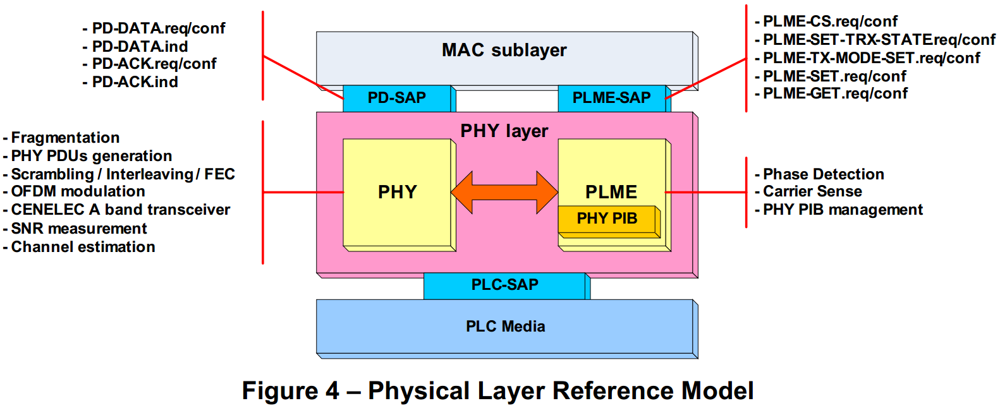

# 8 PRESENTATION OF THE OFDM PLC PHYSICAL LAYER

## 8.1 PHYSICAL LAYER REFERENCE MODEL
　　The Physical Layer Reference Model is presented below:

　　This Reference Model reveals two functional blocks:  
　　该参考模型包含两个功能块：
 * The Physical processing block (PHY) in charge of emission and reception over the PLC medium  
 物理处理块用于PLC介质上的接受和发送
 * The PHY Management Entity (PLME) responsible for managing the PHY layer. It relies in particular on the PHY Information Base (PHY PIB).  
 负责管理PHY层的PHY管理实体（PLME）。它特别依赖于PHY信息库（PHY PIB）。

## 8.2 PHY FUNCTIONS
　　The Physical processing block (PHY) comprises the following functions:  
　　物理处理块包含以下这些功能：  
 * Fragmentation: This function enables a MAC frame exchanged between two neighbours to be divided into segments whose length is optimized according to the negotiated modulation characteristics in order to limit stuffing.  
 分段：该功能使得在两个相邻设备之间交换的MAC帧被划分为其长度根据协商的调制特性被优化的分段，以便限制填充。  
 * Generation of the PHY Protocol Data Units (PHY PDU): there are two types:    
 PHY协议数据单元（PHY PDU）的生成：有两种类型：  
   * PHY Data frame. It adds to any MAC frame a preamble that enables the timing to be retrieved. It is followed by a header (FCH) that contains all the information necessary for the demodulation of the rest of the frame. This header is transmitted in ROBO mode. The very long range of this modulation prevents the hidden node phenomenon.  
   PHY数据帧。 它向任何MAC帧添加使得能够检索定时的前导码。 它后面是包含解调帧的其余部分所需的所有信息的报头（FCH）。 此报头在ROBO模式下传输。 该调制的非常长的范围防止了隐藏的节点现象。  
   * PHY Check frames. There are three check frames (ACK, NACK and FAIL) which are made up solely of a preamble followed by a short header (FCH) ransmitted in ROBO mode.  
   PHY检查帧。 存在三个校验帧（ACK，NACK和FAIL），它们仅由前同步码跟随在ROBO模式中传送的短报头（FCH）组成。  
 * Scrambling / Interleaving / FEC: These functions allow effective correction of transmission errors. They combine convolutive coding (Viterbi) and block coding (Reed-Solomon).  
 加扰/交错/ FEC：这些功能允许有效校正传输错误。 它们组合卷积编码（Viterbi）和块编码（Reed-Solomon）。
 * OFDM modulation. This is based on the dividing of the CENELEC A band into 70 tones (on the HTA network, it is possible to use a widened bandwidth as indicated in paragraph 5.2 of [PHY]). These tones can be modulated in either DBPSK (1 bit per tone), or DQPSK (2bits per tone). The amplitude can be adapted by a pre-emphasis defined on 8 sub-bands.There is Automatic Gain Control (AGC) in reception.  
 OFDM调制。 这是基于将CENELEC A频带划分为70个信道（在HTA网络上，可以使用[PHY]第5.2段所示的加宽带宽）。 这些子载波可以以DBPSK（每信道1比特）或DQPSK（每信道2比特）来调制。 振幅可以通过在8个子带上定义的预加重来适配。在接收中存在自动增益控制（AGC）。
 Some of the 70 tones can be masked by configuration so as not to adversely affect other transmissions, while others can be eliminated because they are polluted by recurrent parasites.  
 70个信道中的一些可以通过配置来屏蔽，以便不会不利地影响其他传输，而其他可以被消除，因为它们被其它配置使用。
 For the ROBO mode, a spread spectrum is superimposed by repeating the information 4 times.  
 对于ROBO模式，通过重复该信息4次来叠加扩展频谱。
 The order of size of the throughputs (70 tones, frames of about 240 bytes) is 30 kb/s for DQPSK, 15 kb/s for DBPSK and 3.5 kb/s for ROBO.  
 吞吐量（70个信道，约240字节的帧）的大小顺序对于DQPSK为30kb/s，对于DBPSK为15kb/s，对于ROBO为3.5kb/s。  
 * Transmission in the CENELEC A band. Two types of coupling are planned for: low and medium voltage.  
 传输在CENELEC A频段。 计划两种类型的耦合：低压和中压。  
 * Measurement of the Signal/Noise ratio: This measurement enables the Link Quality Index (LQI) to be deduced  
 信号/噪声比的测量：该测量使得能够推导链路质量指数（LQI）  
 * Channel estimation. This estimation aims to determine the optimum characteristics (tones,modulation, pre-emphasis) for transmission in one direction between two neighbouringnodes. It must be achieved independently for the two directions of communication to copewith any dissymmetry. If forms the subject of a procedure that associates PHY and MAC:  
 信道估计。 该估计旨在确定用于在两个相邻节点之间的一个方向上的传输的最佳特性（信道，调制，预加重）。它必须独立地实现两个通信方向，以应对任何不对称。将PHY和MAC关联的过程：
   * Between two nodes A and B, for the direction A to B, the estimation request is initiated by the MAC layer of emitter A by positioning a parameter of the PHY service primitive, PD-DATA.req.  
   在两个节点A和B之间，对于方向A到B，通过定位PHY服务原语PD-DATA.req的参数，由发射器A的MAC层发起估计请求。  
   * This request is inserted in the PCH header of the PHY frame transmitted by A.  
   该请求被插入到由A发送的PHY帧的PCH报头中。  
   * The PHY layer of receiver B starts to decode the PCH header, then proceeds with channel estimation further to the request. It stores the estimation parameters in its PHY PIB and associates them with a TMI (Tone Map Indicator) identifier. Then it transmits to its MAC layer a PD-DATA.ind primitive that takes up the request expressed by the MAC layer of the emitter.  
   接收器B的PHY层开始解码PCH报头，然后进一步对该请求进行信道估计。它将估计参数存储在其PHY PIB中，并将它们与TMI（音调映射指示符）标识符相关联。然后，它向其MAC层发送PD-DATA.ind原语，该原语占用由发射器的MAC层表示的请求。  
   * The MAC layer of B retrieves the TMI via the PLME-GET.req primitives and the channel estimation parameters and transmits them to its counterpart A via a MAC Check frame.  
   B的MAC层通过PLME-GET.req原语和信道估计参数检索TMI，并且经由MAC校验帧将它们发送到其对应者A.  
   * On reception the MAC layer of A stores everything in its Neighbours Table. Henceforth all the exchanges in the A-to-B direction shall be made using the Channel Estimation parameters identified by this TMI.  
   在接收时，A的MAC层将所有内容存储在其邻居表中。因此，在A到B方向上的所有交换都应使用由此TMI标识的通道估计参数。

## 8.3 PHY SERVICES PRIMITIVES
　　The PHY services are provided to the higher layer via PHY services primitives through a Services Access Point (PD-SAP):  
　　PHY服务通过服务接入点（PD-SAP）经由PHY服务原语提供给较高层：
 * PD-DATA.request/indication/confirmation: they allow the transmission of a MAC frame by the PHY layer. Among the parameters are found some of those that will be included in the FCH header, including the TMI, the Estimation request and the Acknowledgement request.  
 PD-DATA.request/indication/confirmation：它们允许PHY层传输MAC帧。 在参数中找到将被包括在FCH报头中的那些参数中的一些，包括TMI，估计请求和确认请求。  
 * PD-ACK.request/indication/confirm: they process the acknowledgement by the neighbour.  
 PD-ACK.request/indication/confirm：它们处理邻居的ack确认。

## 8.4 PLME FUNCTIONS
　　The Physical Layer Management Entity (PLME) comprises the following  functions:  
　　物理层管理实体（PLME）包括以下功能：  
 * Carrier detection. This is one of the important elements of the CSMA/CA procedure. It concerns the detection of a signal in conformity with [PHY].  
 载波检测。 这是CSMA/CA程序的重要要素之一。它涉及检测符合[PHY]的信号。
 * Phase detection. It allows identification of the phase on which the meter transmits.  
 相位检测。它允许识别仪表发送的相位。
 * Management of the PHY PIB Information Base  
 PHY层PIB信息库的管理  

## 8.5 PLME MANAGEMENT PRIMITIVES
　　The PLME management services are provided to the higher layer via PLME management primitives through a Services Access Point (PLME-SAP):  
　　PLME管理服务通过PLME管理提供给较高层原语通过服务访问点（PLME-SAP）：  
 * PLME-CS.request/confirm: These primitives activate carrier detection and record the result.  
 PLME-CS.request/confirm：这些原语激活载波检测并记录结果。  
 * PLME-SET-TRX-STATE.request/confirm: These primitives allow switching between emission and reception modes  
 PLME-SET-TRX-STATE.request/confirm：这些原语允许在之间切换发射和接收模式
 * PLME-TX-MODE-SET.request/confirm: These primitives enable the MAC layer to set the transmission parameters (table of tone, etc.) before invoking a PD-DATA.request primitive.  
 PLME-TX-MODE-SET.request / confirm：这些原语使MAC层能够设置在调用PD-DATA.request原语之前的传输参数（音调表等）。  
 * PLME-SET.request/confirm: These primitives set the information in the PHY PIB.  
 PLME-SET.request/confirm：这些原语在PHY PIB中设置信息。  
 * PLME-GET.request/confirm: These primitives retrieve the information from the PHY PIB.  
 PLME-GET.request/confirm：这些原语从PHY PIB检索信息。

 
