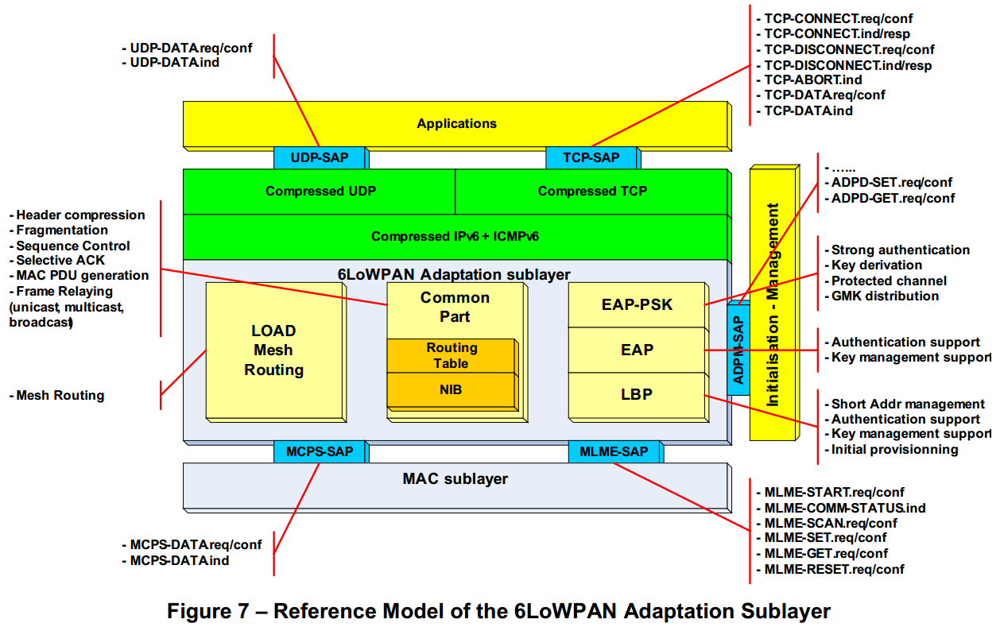

# 9 PRESENTATION OF THE OFDM PLC MAC LAYER

## 9.1 MAC SUBLAYER

### 9.1.1 REFERENCE MODEL OF THE MAC SUBLAYER
　　The Reference Model of the MAC sublayer is shown below:

　　This Reference Model reveals two functional blocks:  
　　该参考模型包含两个功能块：
 * The MAC Common Part Sublayer (MCPS) responsible for communication with the neighbouring nodes  
 负责与相邻节点通信的MAC公共部分子层（MCPS）  
 * The MAC Layer Management Entity (MLME) responsible for management of the MAC sublayer. It relies in particular on the MAC PAN Information Base (MAC PIB) whose main element is the Neighbour Table. This table contains all the information that the MAC and PHY levels need for bidirectional communication with the neighbours.  
 负责管理MAC子层的MAC层管理实体（MLME）。 它特别依赖于其主要元素是邻居表的MAC PAN信息库（MAC PIB）。 该表包含MAC和PHY层级与邻居进行双向通信所需的所有信息。  

### 9.1.2 MCPS FUNCTIONS
　　The MAC Common Part Sublayer (MCPS) processing block comprises the following functions:  
　　MAC公共部分子层（MCPS）处理块包括以下功能：  
 * Generation of the MAC Protocol Data Units (MAC PDU): there are three types:  
 MAC协议数据单元（MAC PDU）的生成：有三种类型：  
   * MAC Data Frame. It adds a variable number of header fields to any 6LoWPAN frame:  
   MAC数据帧。它向任何6LoWPAN帧添加了可变数量的标题字段：  
     * Check frame (compulsory). It identifies the type of frame and its format,etc.  
     检查框架（强制）。 它标识帧的类型及其格式等。  
     * Sequence number (compulsory). It allows the elimination of duplicates when a frame is resent  
     序列号（必填）。 它允许在重新发送帧时消除重复  
     * Source and Destination Addressing for transfer between neighbours. The addresses can be short (16 bits) or long (EUI-64). They can be omitted when they are implicit. The PAN number allows several networks to coexist on the same given infrastructure.  
     源和目标寻址，用于在邻居之间传输。 地址可以是短（16位）或长（EUI-64）。 当它们是隐式时，可以省略它们。 PAN号码允许多个网络在相同的给定基础设施上共存。  
     * Security Header (optional). It contains all the information relative to security (level of security, key identifier, CCM* encryption method counter, etc.)  
     安全标题（可选）。 它包含所有与安全性相关的信息（安全级别，密钥标识符，CCM* 加密方法计数器等）  
     * Message Integrity Check (MIC) in the Security sense (optional). It verifies that the  frame has not been maliciously modified or truncated.  
     在安全意义上的消息完整性检查（MIC）（可选）。它验证该帧未被恶意修改或截断。  
     * Integrity Check in the transmission sense (compulsory). It verifies that the frame has not been modified further to a transmission disturbance.  
     完整性检查传输意义（强制）。 它验证帧尚未被进一步修改为传输干扰。  
   * MAC Check frames. These frames of a similar format enable requests or indications to be exchanged between neighbours: Discovery of the environment  (active scan), Transfer of Channel Estimation parameters, etc.  
   MAC检查帧。 类似格式的这些帧使得能够在邻居之间交换请求或指示：发现环境（主动扫描），传输信道估计参数等。  
   * Beacon Frame. The beacon frame is only emitted on request (active scan) and not cyclically as in other systems. It enables the basic characteristics of the neighbour nodes active on the network to be discovered: PAN number, MAC address, capacities (coordinator, encryption, etc.).  
   信标帧。 信标帧仅根据请求（主动扫描）发射，而不是如在其他系统中那样周期性地发射。 它使得能够发现在网络上活动的邻居节点的基本特征：PAN号，MAC地址，容量（协调器，加密等）。  
   The following figure shows the format of typical MAC frames. The Data frame sent by a coordinator (no source address) directly to an end system, without the participation of a relay node (no Mesh 6LoWPAN header). The payload of the frame is encrypted with Integrity Check, hence the presence of the Security header and the MIC field.
   下图显示了典型MAC帧的格式。 由协调器（无源地址）直接发送到终端系统，没有中继节点（没有网格6LoWPAN报头）参与的数据帧。 帧的有效载荷用完整性检查加密，因此存在安全报头和MIC字段。  
   

 * CSMA/CA Access Method: It is based on carrier detection by the PHY layer (PLMECS.req/conf primitives). The conflict avoidance (CA) algorithm defines three time intervals at the end of emission of a frame:  
 CSMA / CA接入方法：基于PHY层的载波检测（PLMECS.req / conf原语）。 冲突避免（CA）算法在帧的发射结束时定义三个时间间隔：
   * A conflict-free time interval, reserved for the coordinator but who can temporarily delegate usage to another node.  
   无冲突时间间隔，为协调器保留，可以临时将使用权委托给另一个节点。  
   * A priority time interval within which a random delay mechanism avoids conflicts.  
   随机延迟机制避免冲突的优先时间间隔。  
   * A non-priority time interval, with the same random delay mechanism.  
   非优先级时间间隔，具有相同的随机延迟机制。  
 The treatment of Quality of Service (QoS) is therefore organized around the CSMA/CA access method.  
 因此，围绕CSMA / CA接入方法来组织服务质量（QoS）的处理。

 * Reliable data transfer to the immediate neighbours (ACK mechanism). The ACK mechanism is checked by the MAC layer (PD-ACK.req/conf/ind primitives) and the frames belong to the PHY layer to avoid wasting bandwidth.  
 将可靠的数据传输到直接邻居（ACK机制）。 ACK机制由MAC层（PD-ACK.req / conf / ind基元）检查，并且帧属于PHY层，以避免浪费带宽。  
 * Security: encryption in AES-128 CCM* mode, with selection from among 4 Group Session Keys and an Anti-Replay mechanism  
 安全：AES-128 CCM* 模式下的加密，可从4个组会话密钥和反重复机制中进行选择  
 * Network selection (PAN) and addressing of the different nodes: The MAC layer  uses two types of MAC addresses to designate an equipment item:  
 不同节点的网络选择（PAN）和寻址：MAC层使用两种类型的MAC地址来指定设备项：  
   * A long address in EUI-64 format, deduced from the unique EUI-48 address assigned during manufacture of the equipment by adding two 0xFF bytes in its centre.  
   EUI-64格式的长地址，从在设备制造期间分配的唯一EUI-48地址推导出，在其中心增加两个0xFF字节。  
   * A short address on 16 bits assigned dynamically and in a centralized manner thanks to the LBP protocol (6LoWPAN Bootstrap Protocol) [draft-commissioning].  
   由于LBP协议（6LoWPAN引导协议）[draft-commissioning]，以动态和集中方式分配的16位上的短地址。  
 The PAN number is assigned by configuration to its coordinator. It allows the sharing of the PLC infrastructure, including by crosstalk, between several logical OFDM PLC networks.  
 PAN号码通过配置分配给其协调器。 它允许在几个逻辑OFDM PLC网络之间共享PLC基础设施，包括通过串扰。  

### 9.1.3 MCPS SERVICES PRIMITIVES
　　The MCPS services are provided to the higher layer via MCPS services primitives through a Services Access Point (MCPS-SAP):  
　　MCPS服务通过MCPS服务原语通过服务接入点（MCPS-SAP）提供给更高层：  
 * MCPS-DATA.request/indication/confirmation: these primitives allow the MAC layer to transmit a 6LoWPAN frame. Among the parameters are found the MAC and PAN address information and the security parameters. The request primitive includes Quality of Service information and the indication primitive a Quality of Line indicator.  
 MCPS-DATA.request/indication/confirmation：这些原语允许MAC层发送6LoWPAN帧。 在参数中找到MAC和PAN地址信息和安全参数。 请求原语包括服务质量信息和指示原语线路质量指示符。

### 9.1.4 MLME FUNCTIONS
　　The MAC Sublayer Management Entity (MLME) features the following functions:  
　　MAC子层管理实体（MLME）具有以下功能：
 * Active discovery (active scan) of neighbouring nodes. This is activated when a terminal equipment starts or after it has become detached from the network (failure, commanded detachment, etc.). The equipment sends a MAC discovery frame (active scan), to which all the active neighbouring nodes reply by emitting a Beacon frame. The equipment collates the replies (MAC address, PAN number, signal quality, etc.) and classifies them in order of interest. The remainder of the procedure is at 6LoWPAN level and implements the Bootstrap Protocol (LBP) which includes strong authentication,distribution of security keys and transmission of the initial configuration. The LBP dialogue is engaged with the first on the list. If this fails, it proceeds to the next on the list, and so on.  
 相邻节点的主动发现（主动扫描）。 这在终端设备启动时或在其从网络脱离之后（故障，命令分离等）被激活。 设备发送MAC发现帧（主动扫描），所有活动的相邻节点通过发射信标帧来回复。 设备整理回复（MAC地址，PAN号码，信号质量等），并按照感兴趣的顺序对它们进行分类。 该过程的其余部分是在6LoWPAN级别并且实现引导协议（LBP），其包括强认证，安全密钥的分发和初始配置的传输。 LBP对话与列表中的第一个对话。 如果失败，它将继续到列表中的下一个，依此类推。　　
 * Management of the MAC level parameters. These parameters constitute the MAC Information Base (MAC PIB), an integral part of the overall Management Information Base(MIB).  
 管理MAC级别参数。 这些参数构成了MAC信息库（MAC PIB），它是整个管理信息库（MIB）的组成部分。　　
 * Initialization/Reinitialization of the MAC and PHY layers.  
 MAC和PHY层的初始化/重新初始化。　　

### 9.1.5 MLME MANAGEMENT PRIMITIVES
　　The MLME management services are provided to the higher layer via MLME management primitives through a Services Access Point (MLME-SAP):  
　　MLME管理服务通过MLME管理原语通过服务接入点（MLME-SAP）提供给较高层：  
 * MLME-START.request/confirm: these primitives initialize the MAC and PHY layers  
 MLME-START.request/confirm:该原语用于初始化MAC和PHY  
 * MLME-RESET.request/confirm: these primitives reinitialize the MAC and PHY layers.  
 MLME-RESET.request/confirm:重新初始化MAC和PHY  
 * MLME-COMM-STATUS.indication: this primitive signals reception of an erroneous frame for maintenance purposes.  
  MLME-COMM-STATUS.indication:该原语表示出于维护目的的错误帧的接收。  
 * MLME-SCAN.request/confirm: these primitives activate sending of the MAC discovery frame, gathering of the information carried by the Beacon frames and, after a programmable time period, the sending of a list of Neighbours with their main characteristics.  
 MLME-SCAN.request/confirm:用于主动发送一个MAC层的发现帧，然后在一个可编程的时间后向上反馈接收到的相关信标信息。  
 * MLME-SET.request/confirm: these primitives enable information to be set in the MAC PIB.  
 MLME-SET.request/confirm:设置那些可以被配置的MAC PIB  
 * MLME-GET.request/confirm: these primitives serve to retrieve information from the PHY PIB.  
 MLME-GET.request/confirm:从MAC PIB中获取相关信息  

## 9.2 6LOWPAN ADAPTATION SUBLAYER

### 9.2.1 REFERENCE MODEL OF THE 6LOWPAN ADAPTATION SUBLAYER
The Reference Model of the 6LoWPAN Adaptation sublayer is shown below:

This Reference Model reveals three functional blocks:

 * The common processing operations block (Common Part) is responsible for end-to-end communication within the PLC local network (PLC LAN). It is based in particular on the 6LoWPAN Information Base (NIB), the main element of which is the Routing Table. This table contains the identifier of the neighbour node to which a packet is to be routed for each destination node identified by its short address on 16 bits.  
 公共处理操作块（公共部分）负责PLC本地网络（PLC LAN）内的端到端通信。 它特别基于6LoWPAN信息库（NIB），其主要元素是路由表。 该表包含对于由16位的短地址标识的每个目的地节点将要路由的分组所针对的邻居节点的标识符。  
 * The routing function in Mesh mode. Its purpose is to constitute the routing table, and it does this using the LOAD protocol [draft-load], a compact version of the AODV protocol [rfc3561] that is adapted to 6LoWPAN.  
 网状模式下的路由功能。 它的目的是构成路由表，它使用LOAD协议[draft-load]，一种适用于6LoWPAN的AODV协议的精简版本[rfc3561]。  
 * The Security and Initial Configuration function. It uses the LBP (6LoWPAN Bootstrap Protocol) [draft-commissioning] which appears as a grouping of the DHCPv6 [rfc3315] and EAPOL [802.1X-2004] protocols in a compressed version adapted to 6LoWPAN.  
 安全和初始配置功能。 它使用在适用于6LoWPAN的压缩版本中显示为DHCPv6 [rfc3315]和EAPOL [802.1X-2004]协议的分组的LBP（6LoWPAN引导协议）[draft-commissioning]。  
 This protocol enables a terminal equipment to acquire its short MAC address on 16 bits, along with the parameters it needs in order to communicate effectively.  
 该协议使终端设备能够获得16位的短MAC地址，以及有效通信所需的参数。  
 Beforehand, the terminal equipment must authenticate itself and receive the keys necessary for the security of the exchanges. To achieve this, LBP encapsulates the EAP authentication protocol [rfc3748]. This protocol is flexible and supports different methods. The method adopted for the needs of OFDM PLC is EAP-PSK [rfc4764]. It proposes strong authentication based on a secret shared on 128 bits, and a Protected Channel that allows the secure transmission of the session keys that can be used by all the layers.  
 事前，终端设备必须认证自己并接收交换机安全所需的密钥。 为了实现这一点，LBP封装EAP认证协议[rfc3748]。 该协议灵活，支持不同的方法。 用于OFDM PLC的需要的方法是EAP-PSK [rfc4764]。 它提出基于在128位上共享的秘密的强认证，以及允许可以由所有层使用的会话密钥的安全传输的保护信道。  

### 9.2.2 6LOWPAN FUNCTIONS
　　The 6LoWPAN common processing operations block comprises the following functions:  
　　6LoWPAN公共处理操作块包括以下功能：  
 * Compression of Internet and Transport headers. See §5.3.  
 压缩Internet和传输头。 见§5.3。  
 * Fragmentation: This function enables an Ipv6 datagram, whose size can reach 1260 bytes,to be divided into segments better adapted to transport across the PLC LAN.  
 分段：此功能使能Ipv6数据报，其大小可以达到1260字节，被分成更好地适于在PLC LAN上传输的段。  
 * Generation of the 6LoWPAN PDUs: there are two types:  
 6LoWPAN PDU的生成：有两种类型：  
   * 6LoWPAN Data Frame: It adds varying numbers of headers to the Ipv6 datagram(or fragment in the case of a long datagram):  
   6LoWPAN数据帧：它向Ipv6数据报（或在长数据报的情况下的片段）添加不同数量的报头：  
     * Fragmentation header in case of fragmentation or need for reliable transport  
     在分段或需要可靠传输的情况下的分段头  
     * Transmission header in case of Broadcast or Multicast routing  
     在广播或组播路由的情况下的传输报头  
     * Mesh header in case of relaying  
     在中继情况下的网格头  
   * Check frames corresponding to the LBP and LOAD protocols  
   检查对应于LBP和LOAD协议的帧  
 * Packet reordering  
 数据包重排序  
 * Reliable end-to-end data transfer (selective ACK mechanism)  
 可靠的端到端数据传输（选择性ACK机制）  
 * Relaying of MAC frames (unicast, multicast, broadcast). It is based on the information from the routing table and on the definition of the groups for multicast relaying.  
 中继MAC帧（单播，多播，广播）。 它基于来自路由表的信息和用于多播中继的组的定义。

### 9.2.3 ROUTING IN MESH MODE
Calculation of the optimum route between two nodes A and B of the PLC LAN using the LOAD protocol is a decentralized process. It can be triggered either when there is a datagram to transmit,or preventively:  
使用LOAD协议计算PLC LAN的两个节点A和B之间的最佳路由是一个分散的过程。 它可以在有数据报发送时被触发，或者被预防地：  
 * Node A starts by broadcasting an RREQ message carrying a nil total cost.  
 节点A通过广播携带零总成本的RREQ消息开始。  
 * All the network nodes (x = C, D, E and F) capable of propagating this message start by adding their short address on 16 bits and incrementing the total cost of the route by the cost of the segment Ax. If node x already has a route to B, it propagates the RREQ message along that route. If not, the message is broadcast again.  
 能够传播该消息的所有网络节点（x = C，D，E和F）通过将它们的短地址添加到16比特开始，并且通过段Ax的成本增加路由的总成本。 如果节点x已经有到B的路由，它沿着该路由传播RREQ消息。 如果不是，则再次广播该消息。  
 * Node B of the destination thus receives several RREQ messages which have followed different routes whose path is stored in the body of the message. It chooses the route corresponding to the lowest cost and sends back an RREP message that will follow the reverse route to A.  
 因此，目的地的节点B接收已经遵循不同路由的若干RREQ消息，其路径存储在消息的主体中。 它选择与最低成本对应的路由，并发回将沿着到A的反向路由的RREP消息。  
 * On reception of RREP, each node marks the route to B in its routing table.  
 在接收RREP时，每个节点在其路由表中标记到B的路由。  

 

A few remarks:
An aging mechanism that enables the routes to be updated to take account of the appearance or disappearance of nodes and changes on the conditions of propagation.  
老化机制，使路由可以更新，以考虑节点的出现或消失和传播条件的变化。  
The LOAD protocol enables a route to be established between any pairs of nodes in the network.  
LOAD协议使得能够在网络中的任何节点对之间建立路由。  
The cost function is determining in the choice of the optimum route. The route proposed is based on the transfer time (see [MAC-API] Appendix 2).  
成本函数是在选择最佳路线时确定的。 提议的路由基于传输时间（参见[MAC-API]附录2）。  

### 9.2.4 SECURITY AND INITIAL CONFIGURATION
 * Access control and Authentication:  
 访问控制和认证：  
 A Terminal Equipment (i.e. a meter) cannot access the PLC LAN without prior identification (including comparison with white or black lists) and a strong Authentication. Identification and Authentication are based on two parameters that personalize each Terminal Equipment:
 终端设备（例如一块电表）在没有事先识别（包括与白名单或黑名单比较）和强身份验证的情况下不能访问PLC LAN。 识别和认证基于每个终端设备特有的的两个参数：
   * An EUI-48 MAC address as defined in [802-2001]. This address can be easily converted to EUI-64 format as required by [802.15.4-2006] and the associated documents. It is considered to be public.  
   EUI-48 MAC地址，如[802-2001]定义。 该地址可以根据[802.15.4-2006]及相关文档的要求轻松转换为EUI-64格式。 它被认为是公开的。  
   * A secret shared on 128 bits (PSK) used as proof of identity during the authentication process. It is shared between the Equipment itself and an authentication server. The mutual authentication is based on proof that the other party knows PSK. It is of the utmost importance that PSK remains secret.  
   在认证过程中用作身份证明的128位（PSK）共享的秘密。 它在设备本身和认证服务器之间共享。 相互认证基于另一方知道PSK的证据。 最重要的是PSK保持秘密。  

   The Identification and Authentication processes are activated when a Terminal Equipment restarts and can be initiated at any moment in accordance with the applicable Security policy. The corresponding equipment is transported by LBP (6LoWPAN Bootstrapping Protocol) which encapsulates EAP (Extensible Authentication Protocol).  
   识别和认证过程在终端设备重新启动时被激活，并且可以根据适用的安全策略在任何时刻启动。 相应的设备由封装EAP（可扩展认证协议）的LBP（6LoWPAN引导协议）传输。  
   LBP and EAP have been specified to be relayed by intermediate nodes. Thus, during the bootstrap phase, when a Terminal Equipment that has not yet acquired a routable 16-bit address is situated one hop from the Coordinator, it can communicate with the coordinator directly. Otherwise it can use the services of an intermediate node situated one hop from that Terminal Equipment.  
   LBP和EAP已被指定为由中间节点中继。 因此，在引导阶段期间，当尚未获取可路由16位地址的终端设备位于距协调器一跳处时，其可以直接与协调器通信。 否则，它可以使用位于距该终端设备一跳的中间节点的服务。  
   Furthermore, two different authentication architectures can be considered:  
   此外，可以考虑两种不同的认证体系结构：
    * The Authentication Server function is supported directly by the Coordinator, and in this case all the authentication material (access list, proof of identity, etc.) must be loaded into the Coordinator.  
    认证服务器功能由协调器直接支持，在这种情况下，所有认证资料（访问列表，身份证明等）必须加载到协调器中。
    * The Authentication Server function is supported by a remote (and usually centralized) AAA server, and in this case the Coordinator is only  responsible for transmitting the EAP messages to the AAA server by a standard AAA protocol (i.e. RADIUS [rfc2865]).  
    认证服务器功能由远程（通常是集中式）AAA服务器支持，在这种情况下，协调器仅负责通过标准AAA协议（即RADIUS [rfc2865]）将EAP消息传输到AAA服务器。  

    The Authentication process is fully dependent on the EAP method put in place. The EAP protocol is highly flexible and supports various EAP methods (EAP-MD5, EAP-AKA, EAPTLS, etc.). Each method is characterized by its proof of identify (shared secret, certificate, SIM card, etc.) and by its signature and encryption algorithms.  
    认证过程完全取决于放置到位的EAP方法。 EAP协议是高度灵活的，并支持各种EAP方法（EAP-MD5，EAP-AKA，EAPTLS等）。 每种方法的特征在于其标识（共享秘密，证书，SIM卡等）及其签名和加密算法的证明。  
    The proposed method for the PLC LAN is EAP-PSK, for which the objectives are:  
    所提出的PLC LAN的方法是EAP-PSK，其目的是：  
     * Simplicity: it is based entirely on a unique proof of identity (a 128-bit shared secret) and a single cryptographic algorithm (AES-128).  
     简单性：它完全基于唯一身份证明（128位共享秘密）和单个加密算法（AES-128）。  
     * Security: it appears very conservative in its definition by following well known, tried and tested cryptographic schemes  
     安全：它的定义似乎非常保守，遵循着名的，经过试验和测试的加密方案  
     * Scalability: in the case of OFDM PLC, it can be readily extended to support the distribution of group keys.  
     可扩展性：在OFDM PLC的情况下，可以容易地扩展以支持组密钥的分发。  

 * Confidentiality and Integrity  
 保密性和完整性  
 The Confidentiality and Integrity services are ensured at different levels:  
 在不同的级别确保保密性和完整性服务：  
   * At MAC level: as defined in [802.15.4-2006], a CCM* encryption is applied to each frame transmitted between the network nodes. It is a universal Confidentiality and Integrity Service (with Anti-Replay capacities). The MAC frames are encrypted and decrypted at each hop.   
   在MAC层：如[802.15.4-2006]中定义的，CCM* 加密被应用于在网络节点之间传输的每个帧。 它是一个通用的保密和完整性服务（具有抗重放能力）。 MAC帧在每一跳被加密和解密。   
   The only exception concerns a few well verified frames in the first stages of the bootstrap process.   
   唯一的例外涉及在引导过程的第一阶段中的几个很好验证的帧。  
   To effectively support this service, all the network nodes receive the same Group Master Key (GMK). This key is distributed individually to each node in a secure manner thanks to the Protected Channel EAP-PSK.   
   为了有效地支持该服务，所有网络节点接收相同的组主密钥（GMK）。 由于受保护的信道EAP-PSK，该密钥以安全的方式单独分发到每个节点。  
   * At EAP-PSK level: as defined by [rfc4764], EAP-PSK provides Confidentiality and Integrity services (and Anti-Replay protection), also called Protected Channel (PCHANNEL) to the messages exchanged through EAP between Authentication Server and Terminal Equipment.  
   在EAP-PSK级别：由[rfc4764]定义，EAP-PSK为通过EAP在认证服务器和终端设备之间交换的消息提供保密性和完整性服务（和抗重放保护），也称为保护信道（PCHANNEL）。  
   * At the Applications level: as defined in §6.1 and §6.2.2  
   在应用级别：如§6.1和§6.2.2中定义

 * Anti-Replay and Prevention of Denial of Service (DoS)  
 错误自修正和防止拒绝服务（DoS）  
 It is always difficult to parry a DoS attack, and especially those targeting the Physical level,but their impact is limited by nature to a restricted zone.  
 总是难以解决DoS攻击，特别是那些针对物理级别的攻击，但它们的影响受限于受限区域的性质。  
 The CCM* encryption mode is generalized at MAC level. It prevents the non-authenticated Equipment from accessing the network and performing malicious actions on the routing,the configuration or any other low-level process. The only exception is the Bootstrap process, which is well controlled.  
 CCM* 加密模式在MAC层被概括。它防止未经验证的设备访问网络并对路由，配置或任何其他低级进程执行恶意操作。唯一的例外是Bootstrap进程，这是很好的控制。  
 In addition to this, the MAC layer includes an Anti-Replay mechanism.  
 除此之外，MAC层包括抗错误自修正。  
 * Generation and Distribution of Keys  
 密钥的生成和分配  
 The following figure illustrates the key generation process as defined by EAP-PSK.  
 下图说明了EAP-PSK定义的密钥生成过程。  
 The 128-bit Group Master Key (GMK) is generated by the Authentication server, then ransmitted individually and securely to the different nodes via the Protected Channel  EAPPSK (PCHANNEL).  
 128位组主密钥（GMK）由认证服务器生成，然后通过保护信道EAPPSK（PCHANNEL）单独和安全地传输到不同的节点。  
 GMK is assumed to be random but its mode of generation is considered to be purely dependent on the implementation.  
 假定GMK是随机的，但其生成模式被认为是纯粹依赖于实现。  
 GMK is distributed to the nodes under two circumstances:  
 GMK在两种情况下分布到节点：  
   * During the bootstrap process  
   在引导过程中  
   * During the key change process. The GMK lifetime is very long (several tens of years) because of the meter on 4 bytes included in the nonce. It is nevertheless a good policy to change the network keys regularly, or when a node leaves the network.  
   在密钥更改过程中。 GMK的生存期很长（几十年），因为4个字节的计量表包括在随机数中。 然而，有规律地或者当节点离开网络时改变网络密钥是一个好的策略。

  

 * Centralized allocation of short MAC addresses on 16 bits  
 集中分配16位短MAC地址  
 Rather like DHCPv6 would do, the LBP protocol offers the possibility of centralized assigning of an address to each node of the PLC LAN. In this case it is a short 16-bit MAC address. This address is assigned either at the end of the equipment bootstrapping process or when renumbering the network.  
 而不是像DHCPv6那样，LBP协议提供了向PLC LAN的每个节点集中分配地址的可能性。 在这种情况下，它是一个短的16位MAC地址。 此地址在设备引导过程结束时或重新编号网络时分配。  
 * Initial configuration  
 初始配置  
 Likewise, LBP can perform the initial configuring of a terminal equipment.  
 同样，LBP可以执行终端设备的初始配置。
 
